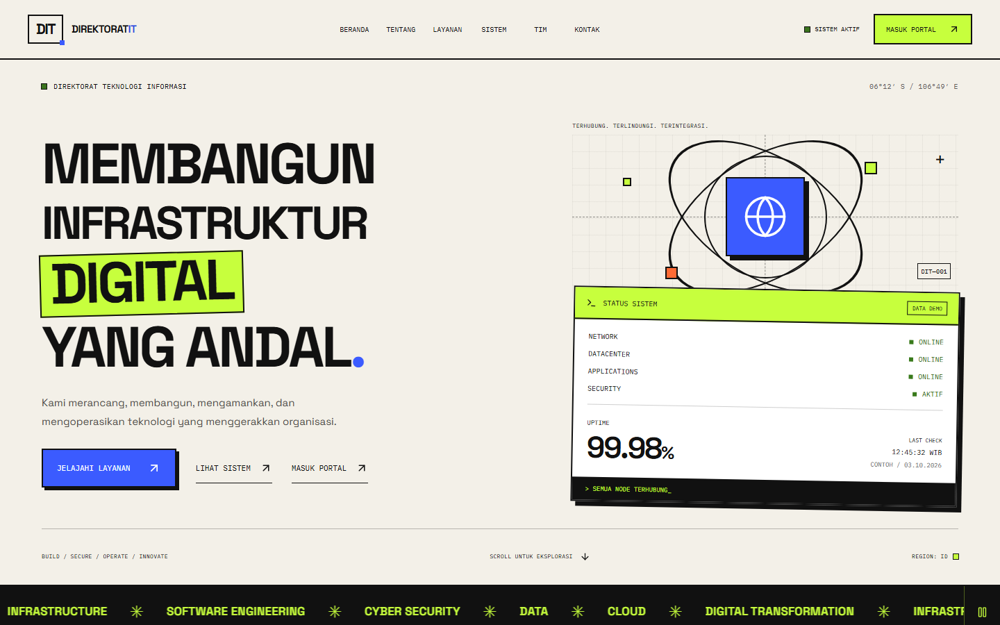
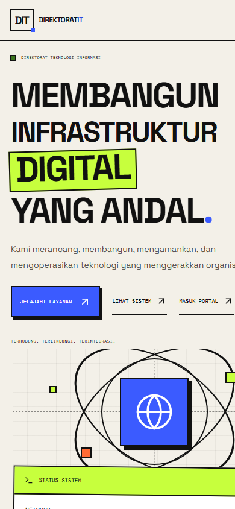
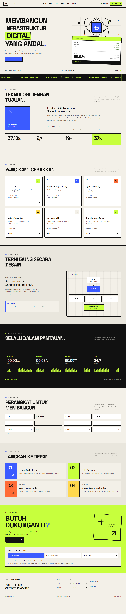

# Direktorat IT

Landing page berbahasa Indonesia dengan SvelteKit, TypeScript, Tailwind CSS, dan Lucide. Seluruh halaman diprerender menjadi HTML statis. Font dibundel lokal; tidak ada ketergantungan font pada layanan eksternal.

## Tangkapan Layar

Situs produksi [it.kskgroup.web.id](https://it.kskgroup.web.id), 3 Oktober 2026.

| Desktop (1440px) | Mobile (390px) |
| --- | --- |
|  |  |

Halaman lengkap (desktop):



## Menjalankan dengan Bun

Gunakan Bun 1.4.2 atau lebih baru.

```powershell
bun install --frozen-lockfile
bun --bun run dev
bun --bun run check
bun --bun run build
bun --bun run preview
```

Development: http://127.0.0.1:5173. Preview build produksi: http://127.0.0.1:4173.

Flag `--bun` memastikan CLI menggunakan runtime Bun. Build menghasilkan direktori `build/` yang dapat disajikan oleh hosting statis tanpa server aplikasi.

## Cloudflare Workers dan monitoring publik

`wrangler.jsonc` menyajikan aset `build/` dan menjalankan `worker/index.ts` untuk
`GET /status.json`. Pengaturan build Cloudflare: `bun run build`, deploy
`npx wrangler deploy`, root `/`. Worker melakukan probe HTTPS dari jaringan
Cloudflare ke domain publik keenam aplikasi. MOPS juga memvalidasi JSON
`https://mops.kskgroup.web.id/healthz`; aplikasi lainnya hanya memeriksa respons
HTTP halaman publik, bukan kesehatan seluruh fungsi bisnis atau database.

Browser memanggil endpoint setiap 60 detik selama dashboard terbuka. Worker
berbagi hasil probe melalui cache edge maksimal 30 detik; respons ke browser
tetap `no-store`. Probe gagal ditandai tidak tersedia pada pemeriksaan tersebut,
tanpa konfirmasi tiga kegagalan dan tanpa riwayat uptime publik yang persisten.

CPU/RAM/disk, status PostgreSQL, dan riwayat uptime lokal dibaca dari collector
server asal melalui variabel `ORIGIN_STATUS_URL`, saat ini
`https://it.kskgroup.web.id/status.json`. Timestamp collector dipertahankan dan
kedaluwarsa terpisah setelah 3 menit. Jika collector tidak tersedia, metrik lokal
ditandai belum diketahui sementara probe publik tetap berjalan. Riwayat lokal
tidak diubah menjadi riwayat uptime publik. Jika domain `it.kskgroup.web.id`
dipindahkan ke Worker ini, arahkan variabel tersebut ke hostname collector yang
terpisah; permintaan rekursif ditolak. Pengembangan dan preview Vite menyediakan
endpoint yang sama melalui middleware, dengan asal probe pada mesin development.

Verifikasi tambahan:

```powershell
bun run check:worker
bun run test:monitoring
```

## Konten dan integrasi

Ubah konten contoh melalui `src/lib/content.ts`. Komponen berada di `src/lib/components/` dan token visual serta breakpoint di `src/app.css`.

Panel hero, dashboard operasional, dan footer berbagi satu polling `/status.json` setiap 60 detik. Deployment Workers memisahkan probe HTTPS publik dari metrik serta riwayat lokal collector server asal. Hero menampilkan minimum uptime lokal teramati dengan cakupan minimum sampelnya selama 30 hari. Data hilang atau lebih lama dari 3 menit menjadi belum diketahui. Belum ada heartbeat sistem lokal per lokasi. Detail pemasangan collector tersedia di [deploy/monitoring/README.md](deploy/monitoring/README.md).

Section Tentang menghitung jumlah aplikasi Web, Mobile, lokal, dan kapabilitas dari katalog website. Jumlah per platform dapat tumpang tindih; tidak menyatakan jumlah instalasi atau layanan aktif. Footer memakai status monitoring yang sama dengan hero/dashboard. Daftar teknologi, inisiatif, dan panel dukungan masih merupakan ilustrasi. Seluruh CTA dukungan terhubung ke portal resmi di [itportal.kskgroup.web.id](https://itportal.kskgroup.web.id).

## Deployment server

Website dipublikasikan pada **3 Oktober 2026** di [it.kskgroup.web.id](https://it.kskgroup.web.id). Server menyajikan build statis melalui Apache dan Cloudflare Tunnel. Panduan update serta rollback tersedia di [deploy/README.md](deploy/README.md).

Verifikasi publik sebelumnya berhasil: HTTPS 200, konten HTML sesuai build lokal (Cloudflare dapat menambahkan skrip analitik), seluruh aset termuat, menu dan diagram berfungsi, tidak ada overflow pada desktop/mobile, cache aset immutable, serta kompresi gzip aktif. Panel dukungan tetap menggunakan mode demo.

Font Space Grotesk dan IBM Plex Mono didistribusikan melalui Fontsource dengan lisensi SIL OFL yang disertakan dalam paket masing-masing. Ikon Lucide menggunakan lisensi ISC.

## Hasil verifikasi

Build statis dan pemeriksaan Svelte/TypeScript berhasil tanpa error atau warning. Pengujian browser mencakup viewport 360, 768, 1024, dan 1440 px; tidak ditemukan overflow horizontal dan seluruh target interaksi yang terlihat memiliki ukuran minimal 44 px. Menu mobile, Escape dan pengembalian fokus, keyboard diagram, kontrol ticker, pilihan dukungan, anchor, reduced motion, serta konten tanpa JavaScript sudah diverifikasi.

Lighthouse mobile pada preview produksi lokal: Performance **99**, Accessibility **100**, Best Practices **100**, dan SEO **100**. Skor ini merupakan pengukuran lokal, bukan jaminan performa di setiap perangkat atau hosting. Laporan JSON dan screenshot verifikasi tersedia di `.qa/` (diabaikan Git).
